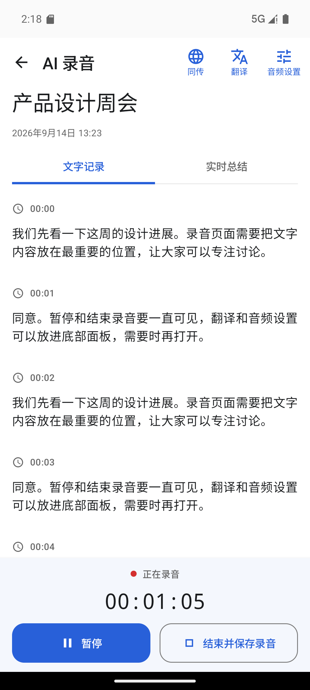
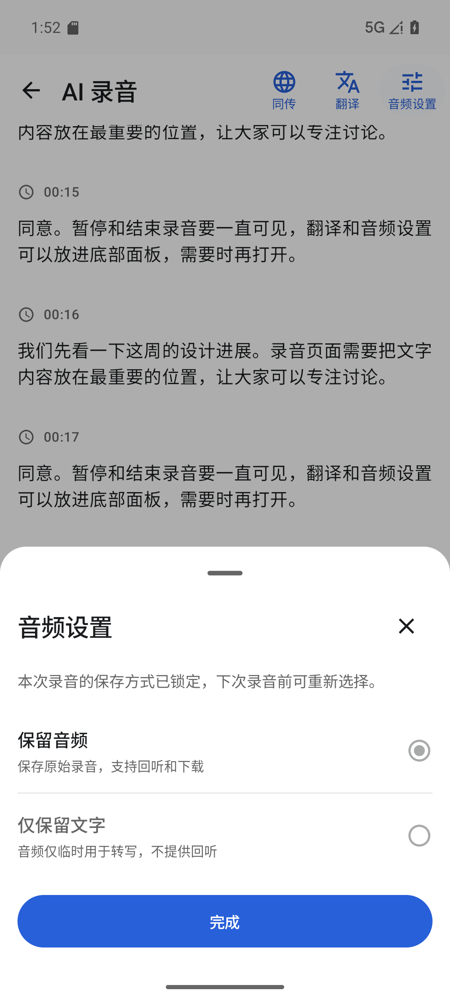
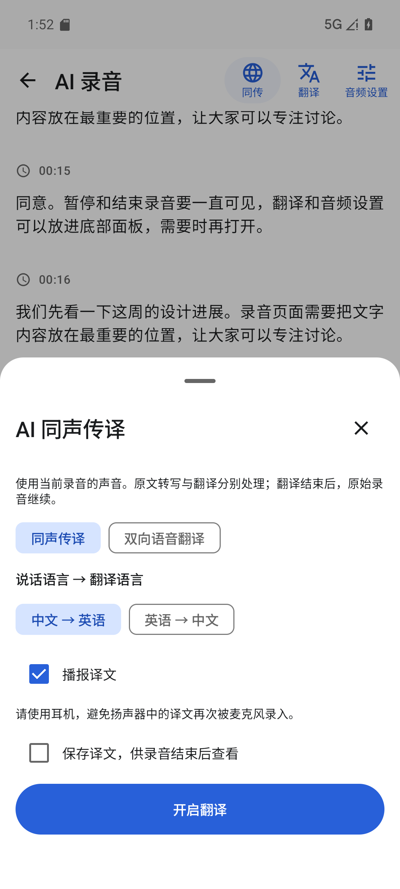
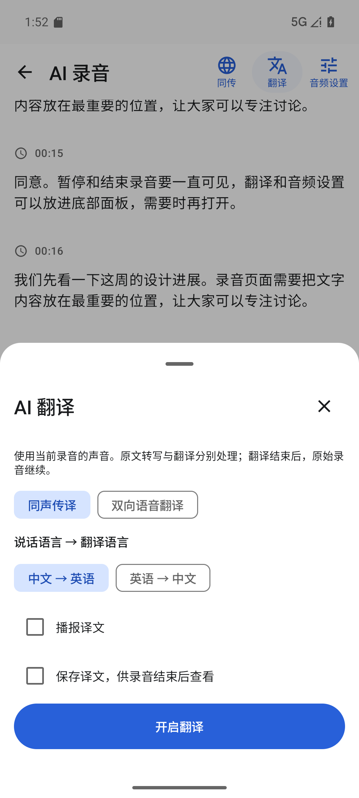

# AI 录音页 UX 调整

参考用户提供的飞书录音、同声传译、AI 翻译和音频设置截图，将 Android 录音页改为以文字阅读为中心的工作区。沿用现有录音服务、转写、总结及翻译接口。

## 页面与交互

- 顶部保留返回与页面名称，同传、翻译和音频设置使用纯图标按钮，形态与「会议实录」顶栏的 AI、搜索、筛选一致；文字不再显示在图标下方，只作为无障碍名称（`contentDescription`）保留。翻译入口按现有功能开关和服务端能力显示。
- 准备页直接显示文字记录与实时总结，不展示标题、标题输入框或“保留音频”快捷入口。音频设置统一从顶部进入。开始录音后展示自动生成的标题和开始时间。
- 转写按真实时间戳分段，正文使用较大的阅读字号。普通后台上传不再显示大块说明；上传失败、中断、临时音频到期时保留恢复提示。
- 底部固定状态、已记录时长与暂停/继续、结束并保存按钮，独立于正文滚动。结束录音仍需确认；保存中的操作禁用，等待完成保存时不允许恢复录音。
- 音频设置使用底部单选面板，说明“保留音频”和“仅保留文字”的区别。录音开始后锁定保存方式；新录音的文字模式仍受服务端能力控制，并展示原有临时音频保留说明。
- 同传入口预选播报译文，翻译入口预选文字译文。打开或关闭面板不启动服务；只有点击“开启翻译”才提交请求。运行中的配置保持锁定，关闭面板不销毁翻译控制器。
- 保留中英互译、双向语音翻译、译文保存、静音、结果核对等原有功能；所有设置面板可滚动并支持系统返回关闭。

## 与参考截图的能力差异

现有转写预览没有说话人字段，展示真实时间戳，不编造说话人。现有翻译接口支持中文和英语，不显示尚未接入的自动识别或其他语言。地点、重点标记、分享和输入音量波形未在这次 UI 调整中新增。计时使用录音服务提供的已记录时长。

## 截图

以下为 Pixel 8 / Android 16 模拟器的中文测试数据截图，不包含用户录音。

| 录音工作区 | 音频设置 |
| --- | --- |
|  |  |

| 同声传译 | AI 翻译 |
| --- | --- |
|  |  |

## 实现位置

- `CaptureScreen.kt`：页面布局、服务绑定与工具区域。
- `CaptureWorkspaceComponents.kt`：标签、正文段落、固定控制区和设置面板。
- `CaptureTranslationPanel.kt`：常驻控制器和按需打开的翻译设置。
- `CaptureAsrPanel.kt`：转写段落的阅读布局。

使用项目现有颜色、字号和尺寸令牌，包含中英文资源。

## 自动命名与重命名

点击开始录音时，按设备本地时间生成 `新录音-yyMMdd-HHmmss`，例如 `新录音-260914-220512`。暂停后继续沿用原名，每次新录音重新生成名称。

录音完成后，可在保存页面或记录详情的“重命名”入口修改名称。名称不能为空、最多 500 字符；保存失败保留输入，不将未保存名称当作成功结果。服务端按记录 ID 保存，历史列表读取同一名称。只有所有者可以重命名已结束的录音。

本次新增后端 `PATCH /api/v1.0/meeting-records/{id}/title/`，需同步发布 `we-meet` 后端；无需数据库迁移。旧服务端未返回 `capabilities.rename` 时，Android 隐藏重命名入口。

[精简后的准备页](reviews/ai-recording-ux/ready.png) · [重命名弹窗](reviews/ai-recording-ux/rename.png)

本轮验证：22 项 JVM 测试、20 项模拟器 UI 回归、14 项后端接口与列表测试通过，构建、设计令牌、Ruff 和差异检查通过。测试使用隔离数据，未发布生产后端。

## 验证结果

- Debug APK 与 AndroidTest APK 构建通过；`checkDesignTokens` 和 `git diff --check` 通过。
- Pixel 8 / Android 16、中文环境下，23 项 UI 回归全部通过：`CaptureScreenTest` 6 项、`CaptureRetentionUiTest` 4 项、`CaptureTranslationPanelTest` 6 项、`CaptureAsrPanelTest` 7 项。
- 覆盖标题传递、暂停和结束确认、长文滚动、音频模式锁定、能力撤回、过期音频恢复、账号切换清理、翻译显式启动和关闭面板、待处理请求核对、转写分页及后台恢复。
- 已检查四张最终截图，并核对中英文资源键一致。

测试使用隔离应用与模拟接口，不连接用户账号，不调用真实模型或麦克风。真机收音和生产服务联调不在本次模拟器验证范围内。

安装包：`app/build/outputs/apk/debug/app-debug.apk`。
